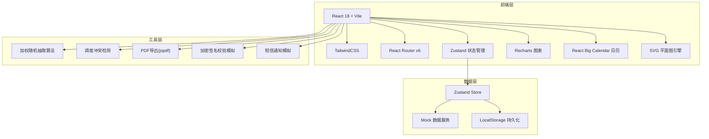
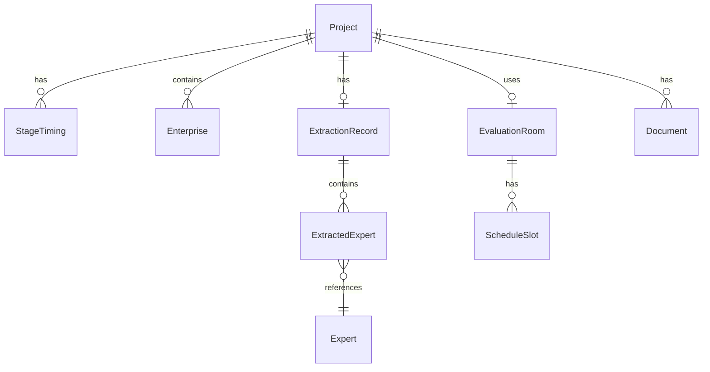

## 1. 架构设计



## 2. 技术说明

- **前端框架**：React@18 + TypeScript + Vite
- **初始化工具**：vite-init (npm create vite@latest)
- **UI样式**：TailwindCSS@3 + 自定义主题变量
- **状态管理**：Zustand（轻量级，适合中型应用）
- **路由**：React Router v6
- **图表库**：Recharts（统计图表）+ React Big Calendar（调度日历）
- **后端**：无后端，使用Mock数据模拟
- **数据持久化**：LocalStorage + Zustand persist middleware
- **PDF导出**：jspdf + html2canvas
- **图标**：Phosphor React Icons
- **字体**：Noto Serif SC + Noto Sans SC（Google Fonts）

## 3. 路由定义

| 路由 | 用途 |
|------|------|
| / | 首页仪表盘，展示今日开评标概览与快捷入口 |
| /projects | 项目管理页面，项目列表与录入 |
| /projects/new | 新建项目录入表单 |
| /projects/:id | 项目详情页，状态追踪与操作 |
| /scheduling | 智能调度页面，日历与分配方案 |
| /approval | 审批管理页面，待审批列表与审批操作 |
| /monitoring | 开评标监控页面，实时状态看板 |
| /documents | 文档管理页面，文件上传与报告签章 |
| /statistics | 统计分析页面，多维度图表与报告导出 |
| /floorplan | 可视化平面图页面，房间状态与热力图 |
| /experts | 专家管理页面，专家库与回避规则 |

## 4. API定义

无后端，使用Mock数据。核心数据接口定义如下：

```typescript
interface Project {
  id: string;
  projectCode: string;
  budgetAmount: number;
  procurementMethod: '公开招标' | '邀请招标' | '竞争性谈判' | '竞争性磋商' | '单一来源' | '询价';
  biddingEnterprises: Enterprise[];
  openBidTime: string;
  status: '待开标' | '开标中' | '评标中' | '结果公示';
  industry: string;
  evaluationRoomId?: string;
  expertGroupId?: string;
  createdAt: string;
  stageTimings: StageTiming[];
}

interface StageTiming {
  stage: '待开标' | '开标中' | '评标中' | '结果公示';
  startTime: string;
  endTime?: string;
  duration?: number;
}

interface EvaluationRoom {
  id: string;
  name: string;
  floor: number;
  capacity: number;
  status: '空闲' | '占用' | '维护';
  currentProjectId?: string;
  scheduleSlots: ScheduleSlot[];
}

interface ScheduleSlot {
  date: string;
  startTime: string;
  endTime: string;
  projectId: string;
}

interface Expert {
  id: string;
  name: string;
  phone: string;
  profession: string[];
  region: string;
  unit: string;
  creditRating: 'A+' | 'A' | 'B+' | 'B' | 'C';
  avoidanceUnits: string[];
  avoidanceRegions: string[];
  status: '可用' | '已抽取' | '已确认' | '已回避' | '迟到';
  confirmedAt?: string;
}

interface ExtractionRecord {
  id: string;
  projectId: string;
  experts: ExtractedExpert[];
  approvalStatus: '待审批' | '已通过' | '已驳回';
  approvedBy?: string;
  approvedAt?: string;
  createdAt: string;
}

interface ExtractedExpert {
  expertId: string;
  weight: number;
  isSelected: boolean;
  response: '待确认' | '已确认' | '已回避';
}

interface Enterprise {
  id: string;
  name: string;
  qualification: string;
}

interface Document {
  id: string;
  projectId: string;
  fileName: string;
  fileType: string;
  fileSize: number;
  uploadTime: string;
  signatureValid: boolean;
  encryptionValid: boolean;
  type: '投标文件' | '评标报告' | '其他';
  signed?: boolean;
  archived?: boolean;
}
```

## 5. 服务端架构图

不适用（纯前端应用）

## 6. 数据模型

### 6.1 数据模型定义



### 6.2 数据定义语言

使用Zustand Store + LocalStorage持久化，初始化Mock数据包含：

- **projects**：8个示例项目，覆盖不同状态与采购方式
- **experts**：30位示例专家，分布不同专业/地域/信用等级
- **evaluationRooms**：6间评标室，分布在2层楼
- **extractionRecords**：5条抽取记录，含不同审批状态
- **documents**：15份示例文档，含不同校验状态
